# SpatialInferCNV Paper Analysis and Conceptual Reproduction

## Project Overview

This repository presents a detailed analysis and conceptual reproduction of the SpatialInferCNV (siCNV) study. SpatialInferCNV is a computational framework designed to infer Copy Number Variations (CNVs) from spatial transcriptomics data, enabling the identification of clonal populations while preserving their spatial organization within tissue samples.

The objective of this project was to understand the biological motivation, computational methodology, and key findings of the paper while implementing simplified reproductions of the major analytical concepts discussed by the authors.

The repository contains paper analysis, figure interpretation, conceptual reproductions implemented in Python, and tutorial-based exploration of the SpatialInferCNV workflow.

---

# Project Objectives

* Understand the research problem addressed in the paper.
* Study the SpatialInferCNV methodology and workflow.
* Analyze the major findings presented by the authors.
* Interpret and summarize the figures included in the publication.
* Reproduce key analytical concepts using simplified computational implementations.
* Explore the official SpatialInferCNV tutorial workflow.

---

# Repository Contents

```text
Project/
│
├── README.md
│
├── reproductionFiles/
│   │
│   ├── reproductionNotebook1.ipynb
│   │   ├── Spatial Clone Visualization
│   │   ├── Clonal Structure Analysis
│   │   ├── Benign vs Malignant Region Comparison
│   │   └── Spatial Heterogeneity Exploration
│   │
│   └── reproductionNotebook2.ipynb
│       ├── CNV Heatmap Simulation
│       ├── Hierarchical Clustering
│       ├── Spatial Clone Mapping
│       └── Clone Size Distribution Analysis
│
├── figures/
│   └── Original figures from the SpatialInferCNV paper
│
├── reproducedFigures/
│   └── Conceptual reproductions implemented in Python
│
└── tutorialBasedReproductions/
    └── Outputs generated using the official SpatialInferCNV tutorial
```

### Repository Organization

The repository is divided into three major components:

1. Original figures from the publication used for reference and interpretation.
2. Conceptual reproductions implemented in Python to understand the analytical concepts presented in the paper.
3. Tutorial-based reproductions generated by following the official SpatialInferCNV workflow.

This organization allows direct comparison between the original publication figures, conceptual reproductions, and outputs obtained from the official implementation.

---

# Paper Summary

SpatialInferCNV uses spatial transcriptomics data to infer copy number variations and identify genetically distinct clonal populations within tissue samples.

The study demonstrates that:

* CNVs can be inferred directly from spatial transcriptomics data.
* Clonal populations can be identified using inferred CNV profiles.
* Cancer-associated genomic alterations may exist in histologically benign tissue.
* Spatial organization of clones provides insights into tumor evolution.
* Histological boundaries do not always correspond to genetic boundaries.

---

# Original Paper Figures

## Figure 1 — Clone Identification Using CNVs

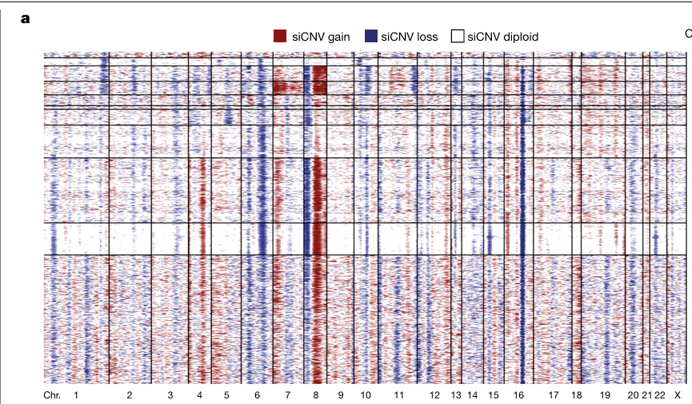

Identification of clone structure in prostate cancer tissue using inferred CNVs and hierarchical clustering.

---

## Figure 2 — Tissue Section Overview

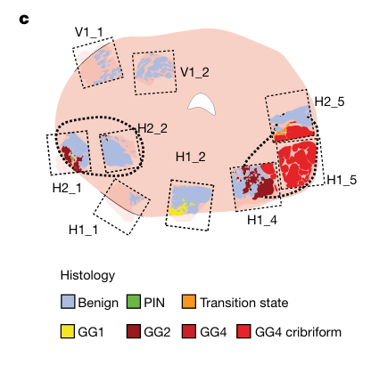

Overview of spatial tissue sections analyzed in the study

---

## Figure 3 — Histological Annotations

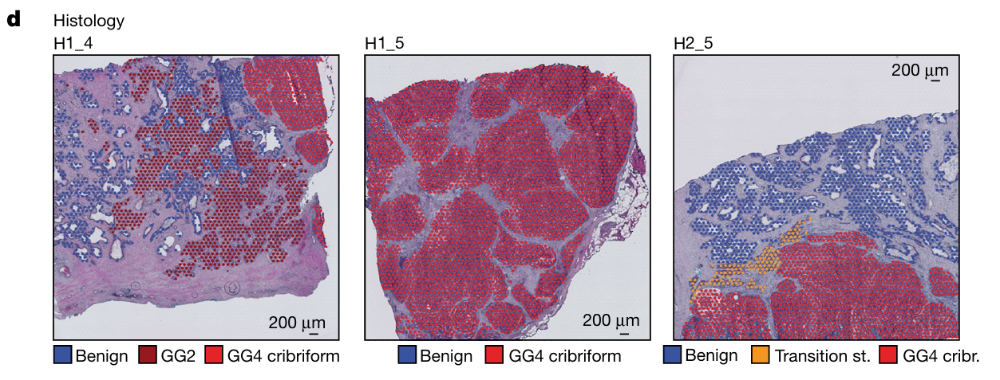

Histological annotations showing benign and tumor regions across tissue sections.

---

## Figure 4 — Spatial Clone Distribution

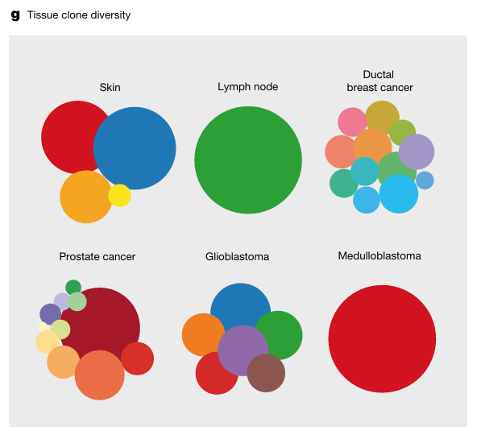

Spatial visualization of clone distributions within tissue.

---

## Figure 5 — Clonal Relationships and Evolution

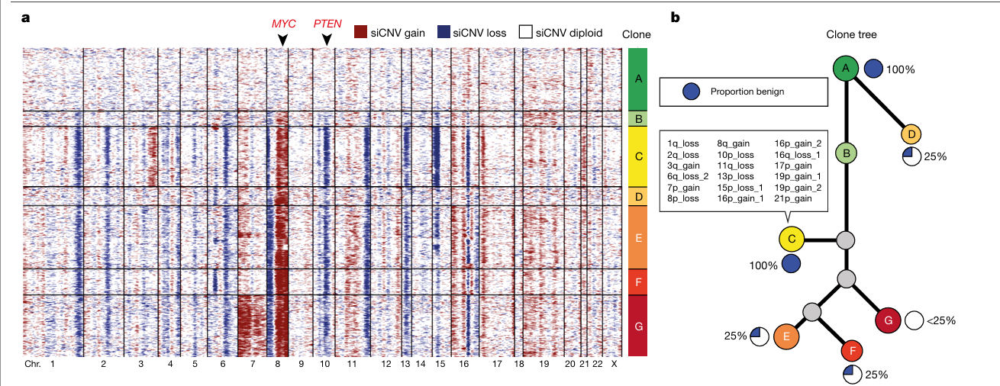

Comparison of clone CNV profiles and evolutionary relationships.

---

## Figure 6 — Histological and Genetic Validation

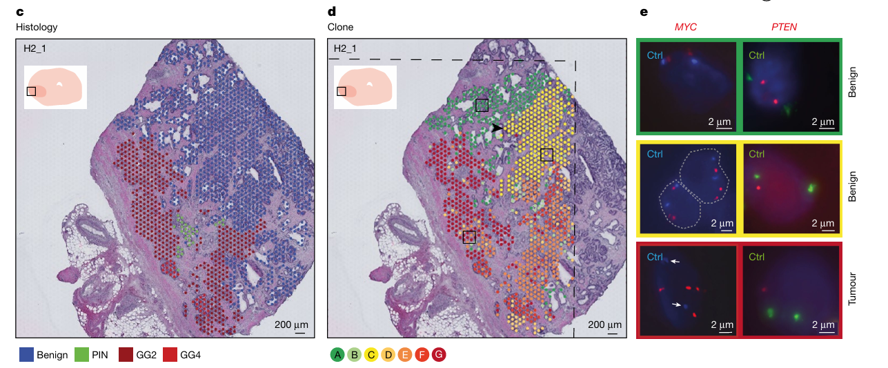

Validation of inferred CNVs through histological comparison and FISH analysis.
---

# Conceptual Reproductions

## Reproduction Notebook 1

Focus: Understanding clonal organization, spatial heterogeneity, and biological interpretation of clone structures.

### Spatial Clone Visualization

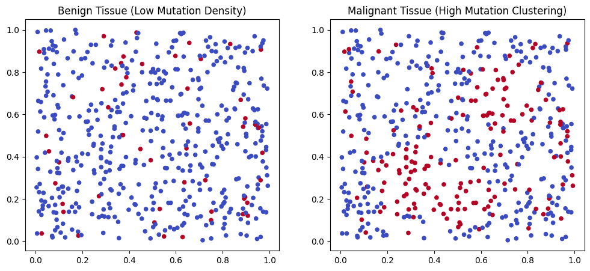

Demonstrates how nearby mutated cells form clusters, representing clonal populations.

### Clonal Structure Analysis

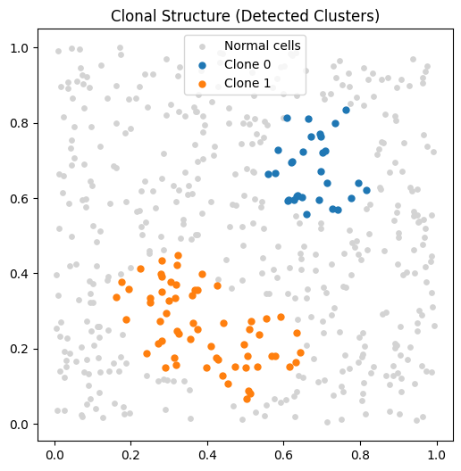

Demonstrates how nearby mutated cells form clusters, representing clonal populations.

### Benign vs Malignant Region Comparison

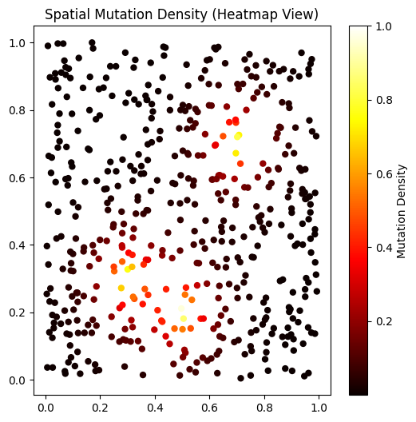

Visualizes variation in mutation intensity across tissue, highlighting regions with higher mutation concentration.

### Spatial Heterogeneity Exploration

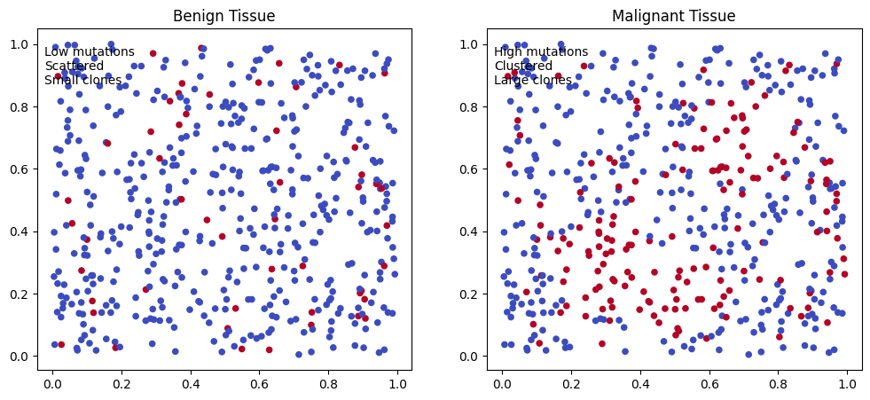

Compares benign and malignant tissue, showing differences in mutation frequency and spatial clustering.

---

## Reproduction Notebook 2

Focus: Understanding CNV inference and computational clone identification.

### CNV Heatmap Simulation

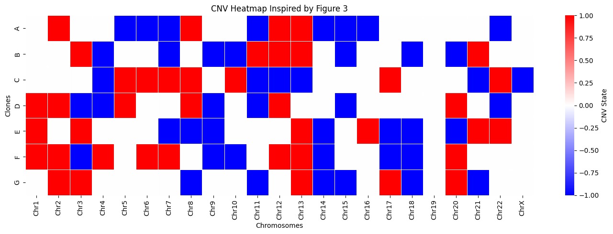

A simulated CNV heatmap was generated to visualize copy number gains and losses across multiple clones.

Related Paper Concept: CNV inference and visualization.

### Hierarchical Clustering

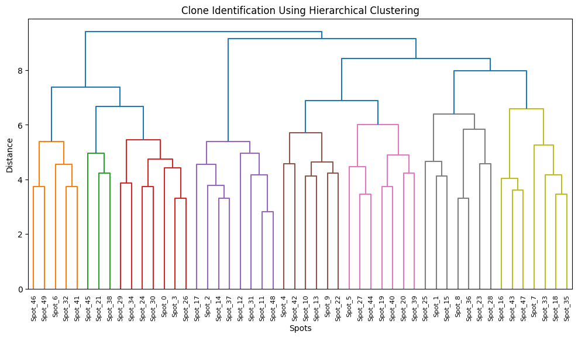

Hierarchical clustering was performed on simulated CNV profiles to demonstrate how genetically similar regions can be grouped into clonal populations.

Related Paper Concept: Clone discovery using CNV similarity.

### Spatial Clone Mapping

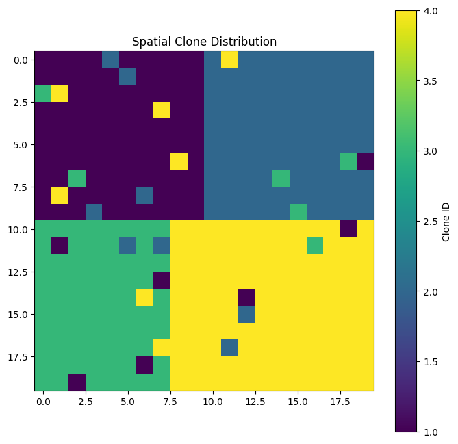

A synthetic tissue grid was generated to visualize how different clones can occupy distinct spatial regions.

Related Paper Concept: Spatial organization of clones within tissue.

### Clone Size Distribution

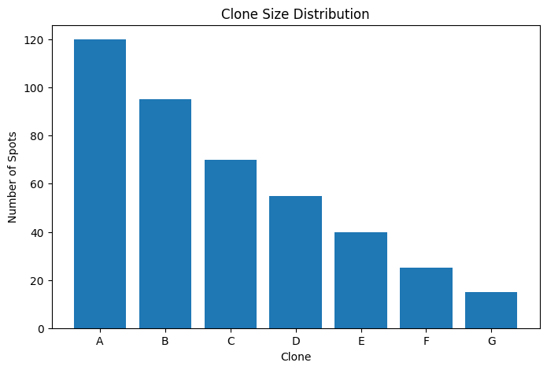

A clone size distribution plot was generated to compare the relative abundance of different clonal populations.

Related Paper Concept: Clonal heterogeneity and population structure.

---

# Figure Reproduction Mapping

| Paper Figure | Reproduction Output                                               | Explanation                                                                    |
| ------------ | ----------------------------------------------------------------- | ------------------------------------------------------------------------------ |
| Figure 1     | [CNV Heatmap](reproducedFigures/CNVheatmap.png)                  | Demonstrates CNV gains and losses across simulated clones.                     |
| Figure 1     | [Hierarchical Clustering](reproducedFigures/hierachalClustering.png)       | Shows grouping of spots into clonal populations using CNV similarity.          |
| Figure 4     | [Spatial Clone Map](reproducedFigures/spatialclonevisualization.png)      | Visualizes spatial distribution of clones across a synthetic tissue grid.      |
| Figure 5     | [Clone Size Distribution](reproducedFigures/CloneSizeDistribution.png)      | Illustrates relative abundance of different clonal populations.                |
| Figure 4     | [Spatial Clone Visualization](reproducedFigures/SpatialCloneMapping.png)  | Demonstrates spatial organization of clonal populations across tissue regions. |
| Figure 5     | [Clonal Structure Analysis](reproducedFigures/clonalArchitecturesofBenignandTumors.png)    | Explores evolutionary relationships and clone development.                     |
| Figure 6     | [Benign vs Malignant Analysis](reproducedFigures/mutationDensityAnalysis.png) | Compares spatial patterns between benign and malignant tissue regions.         |
| Figures 4–6  | [Spatial Heterogeneity Study](reproducedFigures/hierachalClustering.png)  | Investigates heterogeneity and spatial variation across tissue regions.        |
| Figures 1–6  | [Tutorial-Based Reproductions](tutorialBasedReproductions/infercnv)       | Outputs generated by following the official SpatialInferCNV tutorial workflow. |

---

# Reproduction Scope

The reproductions included in this repository are conceptual implementations designed to demonstrate understanding of the analytical principles presented in the SpatialInferCNV paper.

These reproductions are not intended to be exact replications of the publication results. Instead, they provide simplified educational implementations of CNV inference, clone identification, spatial mapping, and tumor heterogeneity analysis.

---

# Learning Outcomes

Through this project, we developed a practical understanding of:

* Spatial transcriptomics technologies
* Copy Number Variation (CNV) inference
* Clonal population identification
* Hierarchical clustering techniques
* Spatial organization of cancer clones
* Tumor heterogeneity
* Cancer evolution and progression
* Computational interpretation of genomic alterations

---

# Team Contributions

## Noor ul Huda

* Literature review
* Paper analysis and interpretation
* Figure analysis
* README preparation
* Conceptual reproductions in Python

## Maryam Ashraf

* SpatialInferCNV tutorial execution
* Workflow exploration
* Output generation and validation

## Amna Zulfiqar

* Repository organization
* Documentation support
* Presentation preparation
